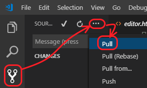
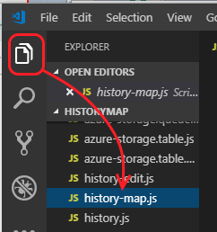

# History Map client code
[History Map](https://www.moylgrove.wales/the-history-map) client for Moylgrove and beyond. The History Map lets people add notes and photos about places on a map. It also shows census data for people who lived in the houses in the 19th century.  The idea is to provide a tool for communities who want to build a picture of the lives of their predecessors. 

An accompanying [phone app](http://bit.ly/moylgrovewalk) shows you the notes about the nearest place as you walk around the village.

## Interesting files

Main map page:
* index.htm
* Scripts/history-map.js  -- four classes: `Place2Manager`, `PersonSearch`, `AudioPlayer`, plus module-level map/zone logic
* Scripts/history-map-places.js  -- `PlaceList` class: left-side index rendering and keyboard navigation
* Scripts/history.js  -- shared functions and startup: loads API keys, `comparable()`, `String.format()`
* css/history.css

Place editor page:
* editor.htm
* Scripts/history-edit.js
* css/history-edit.css

Walkabout app:
* walk.htm -- layout, scripts and styles all in one

Other files:
* dump.htm - a page that shows all the content in one long page. Useful for local historians to print the whole thing off on paper and pore over it.
* Auth.htm, sign*.htm - to do with identifying users. I think one of them is no longer used.
* favicon*.* - the icon that shows in the tabs. Different browsers use different conventions.
* Scripts/map.js  -- `GoogleMap`, `BingMap`, `Pin` classes wrapping the map provider SDKs
* Scripts/azure* -- APIs for storage access

[Server code](https://github.com/alancameronwills/historymap-server) runs in Azure Functions.

## Architecture

The Map app is a web page. Most of the logic is in the client end, written in JavaScript.  
It uses the [Bing map service](https://docs.microsoft.com/en-us/bingmaps/v8-web-control/creating-and-hosting-map-controls/?toc=%2Fen-us%2Fbingmaps%2Fv8-web-control%2FTOC.json&bc=%2Fen-us%2FBingMaps%2Fbreadcrumb%2Ftoc.json), which lets you put dots (and other things) on the map. I use Bing because it provides more detailed aerial shots than Google, and also provides the option of Ordnance Survey maps.
The page and data are served from an [Azure Functions service](https://docs.microsoft.com/en-gb/azure/azure-functions/), and the data is kept in [Azure Storage](https://docs.microsoft.com/en-us/azure/storage/) – blobs for the code and photos, and tables for the text etc associated with each place on the map. I use Azure Functions and Storage rather than a conventional website service because they charge per use rather than per month. Our usage is very low, so it’s only pennies!

When the page loads, it requests the script from the Bing maps service. When that has loaded, the place index is requested, and the dots are put on the map. Both the initial page request and the place index are served by Azure Functions.

At present, the notes for each house are text without embedded images, and all the text for all places is downloaded with the index on startup. Photos and census entries are displayed separately and are requested only when the user clicks a place.

API keys for Azure Functions are not stored in source. On startup, `history.js` fetches them from the Keys API endpoint and stores them in `window.keys`. All subsequent Azure Function calls reference `window.keys.Client_*_FK`.

## To edit and test

### Easy and occasional:

* Download all the files to a PC and put them under C:\inetpub\wwwroot. 
* In a browser on the same machine, run http://localhost.
  * If no response, press Windows key, type *Windows features* and enable **Internet Information Services**
* To edit, run [VSCode](https://code.visualstudio.com/) in administrator mode.  
  Edit the files under \inetpub directly and test //localhost.
* When done, upload changed files to a branch here and create a pull request. Changes are deployed automatically.

### More serious:
One-off setup:
* Install [Git](https://git-scm.com/download).  In a command window, type
   `git config --global user.email "your@email"`
   `git config --global user.name "Your Name"`
* In VSCode, press CTRL+SHIFT+P and type `Git:Clone`. Remote folder `https://github.com/alancameronwills/historymap` and local `\inetpub\wwwroot`. Choose **Open Repository** to inspect the files.

To update the code:
1. **Pull** to make sure your copy is up to date.

   
2. **Edit** a file.

   
3. **Save** your changes.
4. **Test locally** by opening a browser on http://localhost/historymap 
   * The code is the local version, but it's running from the live data table.
   * Press F12 to open the debugger. The most useful page is Sources, where you can set inspect code (for example Scripts/history.js) and set breakpoints where execution will pause and let you inspect variables.
5. **Commit** your changes.

    

   Each commit requires a comment to summarize the changes you've made. You can make multiple commits locally. Commits can be undone if necessary.
6. **Push** your changes to the repository.

   .
   
   You might get a message saying you must pull first. This merges changes someone else has made. Check the merged result before pushing.
   Your push will create a pull request which I'll be notified of, and will review and doubtless accept.
7. **Test live** http://bit.ly/moylgrovehistory Changes are deployed automatically a minute or so after merging into master.

### Inspecting and fixing data

•	[Azure Storage Explorer](https://azure.microsoft.com/en-gb/features/storage-explorer/) is for inspecting and editing blob and table storage directly. Useful for uploading census data and for inspecting and fixing messed-up text entries.
•	I’ve written a small tool for uploading census data from a spreadsheet.
•	http://Crossbrowsertesting.com is one of various tools for exercising the UI on multiple devices and browsers. It has a monthly subs, which I’ve given up at present.

## Automated Testing & Monitoring

Microsoft Application Insights is useful for a variety of things:
* Availability tests check that index.htm and edit.htm are available and load OK. They don't test the functionality. I get an email if they fail.
* Counts of users and what they're doing.
* Performance of various functions.

I also have an automated GUI test that runs on a PC. It just runs at intervals, not when the code is updated.

## Improving the phone app

### Phone app as web page
Currently, the phone app is also implemented as a web page: You load the page before you set off on your walk. This makes it easier to implement and update; but if the user has to restart the app or phone for any reason, they have to get back to a signal – which in Moylgrove isn’t always easy. (I’ve stood outside someone’s house logging in to the BT Fon system a few times.) 

Users often aren’t aware that their phone’s web browser has tabs. If they click away from the app page, they don’t find their way back to the app tab, but instead think they need to reload it.

There are two approaches to mitigating these drawbacks. 

One is to write a proper phone app that users get from the app store and install on the phone. This only partly solves the offline problem, as map and place data would still have to be downloaded. Apps are generally written for two platforms: iOS and Android; there are tools that help minimize the work required to fit each. Test runs are a hassle, as you need a phone simulator; and the iPhone simulators only run on a Mac. However, there are now some cloud-based tools. For example, Microsoft App Center provides build, dev and test in the cloud.

Apps have to be uploaded to the iPhone and Google Play stores. The iPhone store charges a monthly fee, and Google has a one-off charge.
A more promising approach is to keep the app as a web page, but induce the phone to cache as much as possible locally, both of the code and the data. The app starts faster, can be restarted when out of signal range, and will flexibly cache text and photos if it has spare memory. The key ideas are service workers (see also) and web storage. 

### GUI

The current UI is a bit basic. Adobe XD is good for prototyping GUI.

